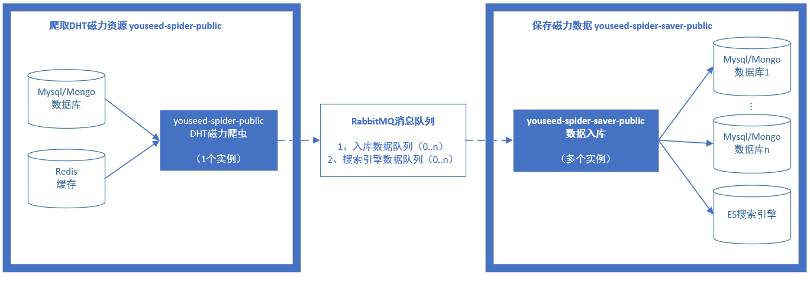

# Youseed磁力爬虫入库程序 #

此程序使用Java编写，负责将rabbitMQ消息队列中的数据保存至数据库或者搜索引擎。

注意：此程序是上图右侧方框“保存磁力数据”的部分。

- DHT爬虫：[https://github.com/dht-open/youseed-spider-public](https://github.com/DHT-open/youseed-spider-public)
- 爬虫数据入库：[https://github.com/DHT-open/youseed-spider-saver-public](https://github.com/DHT-open/youseed-spider-saver-public)

*此程序仅用作技术学习和研究*

# 功能 #

读取消息队列，将爬虫抓取到的数据保存至：

- Youseed Mongodb数据库；
- Youseed Elasticsearch搜索引擎；
- “纸上烤鱼磁力搜索引擎”数据库

**注意**：此爬虫程序主要负责保存数据，需要配合“dht_spider.py”，或者“dht_spider_zsky.py”爬虫程序使用。

# 程序特点 #

1. 兼容性：支持Mongodb、Mysql和Elasticsearch搜索引擎；
2. 实时和定时：支持Elasticsearch中新资源的实时索引，支持旧资源的定时更新；
3. 支持不良资源鉴定：依据`spam.txt`中的关键字鉴别不良资源，并予以标记

# 硬件要求 #

- 内存：约200M

# 软件要求 #

需要安装以下软件：

- jdk运行环境

# 安装（以centos7为例） #

## 安装JDK ##

    yum install java-1.8.0-openjdk.x86_64

## 下载程序 ##

将编译好的jar包`spider-saver-public-1.0.0.jar`和配置文件`youseed-spider-saver.yml`下载至本地。

## 修改配置 ##

编辑文件`youseed-spider-saver.yml`，修改连接配置：

    #MongoDB连接配置
    mongo: 
      url: 127.0.0.1
      port: 27017
      db: seed
      admindb: 
      user: 
      psw: 
    
    #ES搜索引擎连接配置 
    es:
      url: 127.0.0.1
      port: 9300
    
    #mysql连接配置（for 纸上烤鱼） <------------------纸上烤鱼程序修改这个连接
    mysql:
      url: jdbc:mysql://localhost:3306/zsky?useUnicode=true&characterEncoding=utf-8&serverTimezone=GMT%2B8
      user: root
      psw: 

# 运行 #

编译好的程序在这里下载：
[https://github.com/DHT-open/youseed-spider-saver-public/releases](https://github.com/DHT-open/youseed-spider-saver-public/releases "https://github.com/DHT-open/youseed-spider-saver-public/releases")

## 控制台运行 ##
使用如下命令在控制台运行入库程序（注意--config的值必须是绝对路径）：

    java -jar -Xms50m -Xmx128m /opt/spider/app/youseed-spider-saver-public-1.0.0.jar --config=/opt/spider/app/youseed-spider-saver.yml

程序会输出可选命令：
    
    m: 写入/更新Mongodb
    m1: 	|-------写入新资源到Mongo
    m2: 	|-------更新Mongo
    m3: 	|-------写入统计到Mongo
    es: 写入/更新ES（根据esUpdateTime设置，自动选择实时或定时更新）
    es1: 	|-------写入新资源到ES
    es2: 	|-------更新ES（常驻内存并实时更新）
    es3: 	|-------更新ES（更新完毕当前批次后关闭）
    zsky: 写入/更新纸上烤鱼（zsky）
    zsky1: 	|-------写入新资源到Mysql
    zsky2: 	|-------更新Mysql
    zsky3: 	|-------写入统计到Mysql
    
    请选择一项操作（输入编号后回车）:
    
接下来输入`zsky`保存到“纸上烤鱼”数据库

## 后台运行 ##
输入如下命令，后台启动“纸上烤鱼”入库

    nohup java -jar -Xms50m -Xmx128m /opt/spider/app/youseed-spider-saver-public-1.0.0.jar --config=/opt/spider/app/youseed-spider-saver.yml zsky > /opt/spider/logs/spider-saver-mongo.log 2>&1 &

